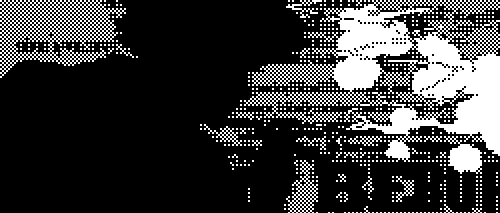
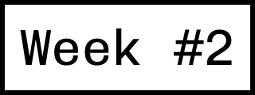
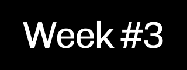
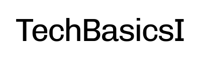
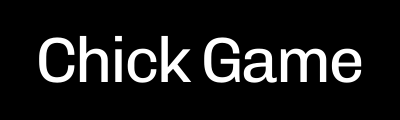

View on GitHub Pages for best experience

<head>

<link rel="preconnect" href="https://fonts.googleapis.com">
<link rel="preconnect" href="https://fonts.gstatic.com" crossorigin>
<link href="https://fonts.googleapis.com/css2?family=Chivo+Mono:ital,wght@0,100..900;1,100..900&family=Stack+Sans+Headline:wght@200..700&display=swap" rel="stylesheet">

</head>

 .--..--..--..--..--..--..--..--..--..--..--..--..--..--..--..--..--..--. 
/ .. \.. \.. \.. \.. \.. \.. \.. \.. \.. \.. \.. \.. \.. \.. \.. \.. \.. \
\ \/\ `'\ `'\ `'\ `'\ `'\ `'\ `'\ `'\ `'\ `'\ `'\ `'\ `'\ `'\ `'\ `'\ \/ /
 \/ /`--'`--'`--'`--'`--'`--'`--'`--'`--'`--'`--'`--'`--'`--'`--'`--'\/ / 
 / /\                                                                / /\ 
/ /\ \  ██╗    ██╗██████╗     ██████╗ ███████╗██████╗  ██████╗ ██╗  / /\ \
\ \/ /  ██║    ██║██╔══██╗    ██╔══██╗██╔════╝██╔══██╗██╔═══██╗██║  \ \/ /
 \/ /   ██║ █╗ ██║██████╔╝    ██████╔╝█████╗  ██████╔╝██║   ██║██║   \/ / 
 / /\   ██║███╗██║██╔═══╝     ██╔══██╗██╔══╝  ██╔═══╝ ██║   ██║╚═╝   / /\ 
/ /\ \  ╚███╔███╔╝██║         ██║  ██║███████╗██║     ╚██████╔╝██╗  / /\ \
\ \/ /   ╚══╝╚══╝ ╚═╝         ╚═╝  ╚═╝╚══════╝╚═╝      ╚═════╝ ╚═╝  \ \/ /
 \/ /                                                                \/ / 
 / /\.--..--..--..--..--..--..--..--..--..--..--..--..--..--..--..--./ /\ 
/ /\ \.. \.. \.. \.. \.. \.. \.. \.. \.. \.. \.. \.. \.. \.. \.. \.. \/\ \
\ `'\ `'\ `'\ `'\ `'\ `'\ `'\ `'\ `'\ `'\ `'\ `'\ `'\ `'\ `'\ `'\ `'\ `' /
 `--'`--'`--'`--'`--'`--'`--'`--'`--'`--'`--'`--'`--'`--'`--'`--'`--'`--' 

 <!-- Div that wraps everything together, because I was too tired to fix the problem with sliding bars -->
<!-- Main blocks -->
<!-- WP REPO ASSIGNMENT top-bar -->

    Web Programming Repository:
    
 <!-- WP REPO ASSIGNMENT top-bar -->

<!-- Name text -->

    Sir_Arsen speaking...
    
 <!-- Name text -->

<!-- Small greeting message -->

    
 
        

        
    

    
 
        > Welcome to repository that stores my assignments for Web Programming class!
    

 <!-- Small greeting message -->

 

<!-- the "buttons" -->

    
    
    

 <!-- the "buttons" -->

<!-- Other repos top-bar -->

    Other Repos:
    
 <!-- Other repos top-bar -->

<!-- Other repos -->

    
    
    

<!-- Other repos -->

<!-- Portfolio tob-bar -->

    Portfolio:
    
 <!-- Portfolio tob-bar -->

<!-- Portfolio & Socials -->

    
    

 

<!-- Portfolio & Socials -->

<!-- Main blocks -->

